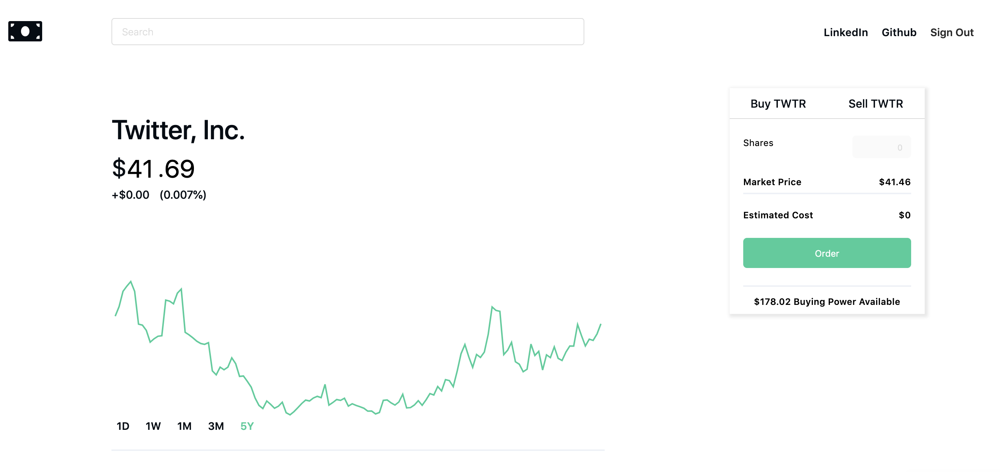
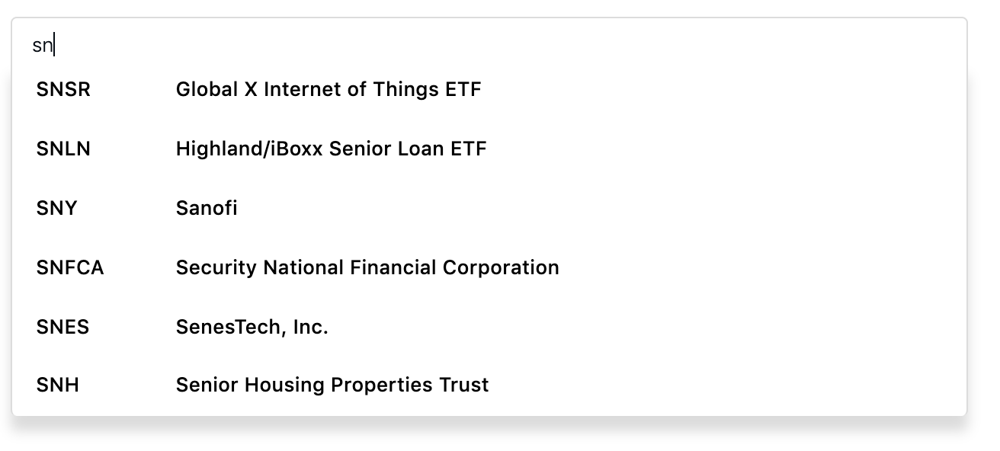

# README

[View Live Site Here](https://merrymoney.herokuapp.com/#/)
---


## About
MerryMoney is a clone of popular trading application Robinhood. I chose to work on a Robinhood clone because the application combines the simplicity of a beautiful interface and the complexity of conveying critical investment information to the average investor. I partitioned MerryMoney into 6 main phases during a 10-day sprint in which I used React, Redux, Javascript, and Ruby on Rails. These phases included implementing user authentication, extracting and visualizing real-time company information, displaying user portfolio performance, handling user transactions, and enabling the creation of company watchlists. 

## Technologies
* Frontend: React, Redux
* Backend: Ruby on Rails, PostgreSQL 
* Data Visualization: Recharts Library
* Financial Data: IEX Trading API
* News Data: News API
* Styling: CSS and HTML5

## Features 

### User Authentication
The user authentication phase consisted of two main parts, the safe encryption of password information and the rendering of appropriate errors upon login or signup. I used the Ruby BCrypt gem, a hash algorithm to ensure a safe web application experience.  


### Data Visualization
I used the Investor Exchange (IEX) API to retrieve company financials. After seeding my database with companies on the NASDAQ, NYSE, and AMEX stock exchanges, I fetched real time data to reflect price performance in using Recharts. One challenge I faced was minimizing the number of API calls in order to sufficiently curb against meeting the message quota on IEX. In order to efficiently minimize the number of datapoints, I first applied a query string filter for the section of data relevant to a given interval. After reducing the five years data of extracted for a single query, the next step was displaying the data for the one day, one week, one month, three month, and five year timeframes. Because portfolio value is driven by user transactions and market activity, my approach was to iterate through all of a given user's transactions and extract historical pricing information for each stock. My implementation is as follows:      

```
portfolioData(timeframe, interval, label) {
        const transactions = this.props.transactions;
        let newPortValues = {};

        Promise.all(transactions.map( (transaction) => {
            return this.props.fetchCompanyHistoricPrices(transaction.ticker, timeframe, interval)
                .then( (res) => {
                    const companyPrices = Object.assign([], res.prices);
                    companyPrices.forEach((price) => {
                        const priceTime = new Date(this.convertDateObjParams(price));
                        const transactionTime = new Date(transaction.created_at);

                        if(transactionTime <= priceTime) {  
                            const date = timeframe === "1d" ? price.label : this.formatDayDate(price.date) 

                            if(newPortValues[date] === undefined) newPortValues[date] = 0;

                            if (transaction.buy) {
                                newPortValues[date] += (transaction.quantity * price.close);
                            } else {
                                newPortValues[date] -= (transaction.quantity * price.close);
                            }
                        }
                    });
                });
            })).then( () => {
                this.setState({ 
                    [label]: this.reformatPortData(newPortValues),
                    currentChart: label,
                });
            });
    }
```

### News
In addition to the portfolio analysis feature, I integrated a news feature using the News API. On the dashboard, users can access relevant information specifically tailored towards their portfolios and on the individual stock pages users can access company- specific information.


### Search bar
Users can search for companies by either ticker or company name. The search bar will query the database and return the closest matches of the user's input. In the future, I plan to implement a toggle feature that reflects the user and the company result's matching characters.  



### Future Features
* Compare companies with corresponding line charts 
* Add dark mode toggle when the market closes 
* Analyst ratings and reviews on the company page 


